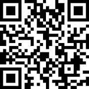

The most up-to-date Office Hours Schedule:

## Professor Office Hours

**Location**: Rice Hall 404

* Mondays 11 am to 12 pm on [Zoom](
  https://virginia.zoom.us/j/92343596331?pwd=UEJsc2twMFBlMldwRmMxQTJkSmJtZz09&from=addon
  )
* Tuesdays 11 am to 12 pm in Rice 202
* Wednesdays 11 am to 12 pm on [Zoom](
  https://virginia.zoom.us/j/92343596331?pwd=UEJsc2twMFBlMldwRmMxQTJkSmJtZz09&from=addon
  )
* Thursdays 11 am to 12 pm in Rice 202

## TA Office Hours

**Location:** The Stacks (Thornton A-Wing)

* **Mondays:** 9:00 am - 3:30 pm
* **Tuesdays:** 12:30 pm - 7:00 pm
* **Wednesdays:** 10:30 am - 12:00 pm AND 1:00 pm - 3:30 pm AND 5:00 pm - 6:30 pm
* **Thursdays:** 11:00 am - 3:30 pm AND 4:00 pm - 5:30 pm
* **Fridays:** 9:00 am - 10:30 am AND 2:00 pm - 7:00 pm

TA Office Hours will *not* be held on days without class (such as Fall Break, Election Day, etc.)

## TA Office Hours Wait List

To get help in TA office hours, join the queue using the following link: https://beta.mydigitalhand.org/

And the course entry code: **S9X1GYZ**

Alternatively, you may use the following QR Code:

